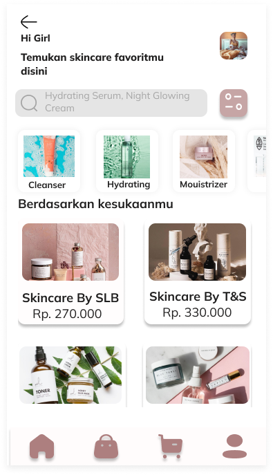
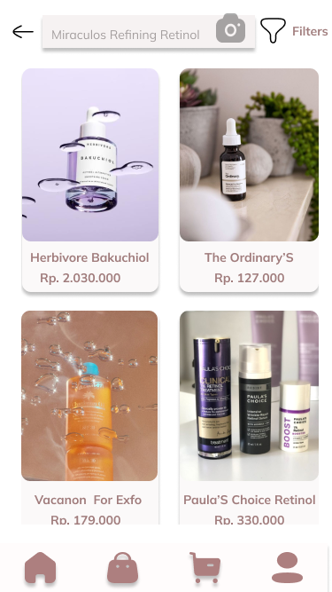

# UI/UX Design — Skincare E-commerce Mobile App

Designed a complete mobile shopping experience for a skincare 
e-commerce app, from onboarding to checkout. Focused on creating 
a clean, feminine aesthetic that builds trust and simplifies 
product discovery for skincare buyers.

## Key Screens
- Login & Sign Up
- Product Catalog & Recommendations
- Shopping Cart & Checkout

## Tools
- Figma

## Design Preview
[View Full Design on Figma]([https://www.figma.com/design/thwglyhmqqOa5SjuvPP2Nk/210180037_Rehan-Zubaidari_A5_Mobile1?node-id=0-1&t=ckQmXYZoay0vr1Uv-1])

## Screenshots

